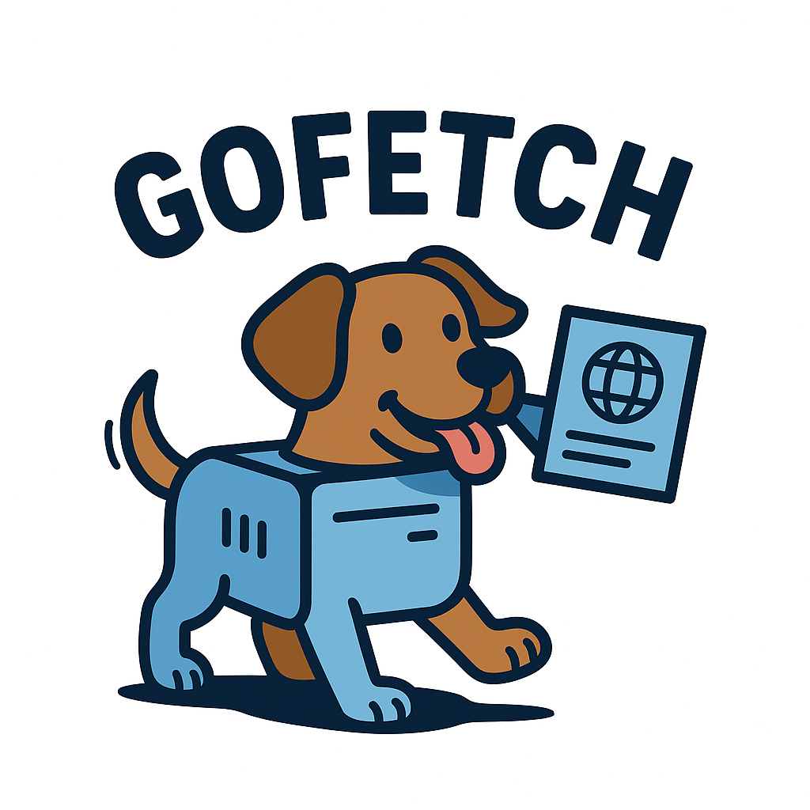

<div align="center">


[![GitHub Release][release-img]][release]
[![Test][test-img]][test]
[![Go Report Card][go-report-img]][go-report]
[![License: Apache-2.0][license-img]][license]
[![GitHub Downloads][github-downloads-img]][release]
![Docker Pulls][docker-pulls]
</div>

<!-- <span style="display: inline-block; vertical-align: top;"> -->

An SSE Go implementation of the `gofetch` MCP server that retrieves web content.</span>


## Features

- **Web Content Retrieval**: gofetches URLs and extracts textual content
- **Content Extraction**: Extract main content from web pages
- **Robots.txt Compliance**: Respects robots.txt rules (can be disabled)
- **Configurable**: Supports custom user agents and proxy settings

## Why _this_ fetch and not `mcp/fetch`?

This Go implementation provides similar functionality as the original
[Python MCP fetch server](https://github.com/modelcontextprotocol/servers/tree/main/src/fetch)
but has the following benefits:

- Lower memory usage
- Faster startup time / shutdown time
- Single binary deployment - making tool poisoning attacks harder than in
  interpreted languages
- Better concurrent request handling
- Better container security
  [than original](https://github.com/modelcontextprotocol/servers/blob/main/src/fetch/Dockerfile)
  - Non-root user
  - Distroless / minimal image
  - Container signing with build provenance
- Uses SSE transport instead of STDIO
- More test coverage

## Prerequisites

- Go 1.24 or later
- [Task](https://taskfile.dev/) for running tasks

## Installation

1. Clone the repository:

   ```bash
   git clone https://github.com/StacklokLabs/gofetch.git
   cd gofetch
   ```

2. Install dependencies:

   ```bash
   task install
   ```

3. Build the server:

   ```bash
   task build
   ```

## Usage

### Running the server

To run the server with the default kubeconfig:

```bash
task run
```

The server will start and expose:

- SSE endpoint: `http://localhost:8080/sse`
- Message endpoint: `http://localhost:8080/message`

#### Command Line Options

- `--addr`: Address to listen on (default: ":8080", can be set via MCP_PORT env
  var)
- `--user-agent`: Custom User-Agent string (default: "Mozilla/5.0 (compatible;
  MCPGoFetchBot/1.0)")
- `--ignore-robots-txt`: Ignore robots.txt rules
- `--proxy-url`: Proxy URL for requests

#### Examples

```bash
# Basic server on port 8080
./gofetch --addr :8080

# Custom port with user agent
./gofetch --addr :3000 --user-agent "MyBot/1.0"

# Ignore robots.txt on custom port
./gofetch --addr :8080 --ignore-robots-txt

# Use proxy
./gofetch --addr :8080 --proxy-url "http://proxy.example.com:8080"

# Use environment variable for port
MCP_PORT=9090 ./gofetc
```

### Docker Usage

```bash
# Build Docker image
docker build -t gofetch .

# Run with default settings
docker run -p 8080:8080 gofetch

# Run with custom arguments
docker run -p 9090:9090 gofetch --addr :9090
```

### Testing the Server

```bash
# Send MCP request
curl -X POST http://localhost:8080/message \
  -H "Content-Type: application/json" \
  -d '{"jsonrpc": "2.0", "id": 1, "method": "tools/list"}'

# Test SSE connection
curl -N http://localhost:8080/sse
```

## MCP Tools

The server provides a single tool called `gofetch` with the following parameters:

### Tool: `fetch`

Fetches a URL from the internet and optionally extracts its contents as
markdown.

#### Parameters

- `url` (required): The URL to fetch
- `max_length` (optional): Maximum number of characters to return (default:
  5000, max: 1000000)
- `start_index` (optional): Starting character index for content extraction
  (default: 0)
- `raw` (optional): Return raw HTML content without simplification (default:
  false)

#### Examples

```json
{
  "name": "fetch",
  "arguments": {
    "url": "https://example.com"
  }
}
```

```json
{
  "name": "fetch",
  "arguments": {
    "url": "https://example.com",
    "max_length": 1000,
    "raw": false
  }
}
```

## Development

### Running tests

```bash
task test
```

### Formatting code

```bash
task fmt
```

### Linting code

```bash
task lint
```

### Updating dependencies

```bash
task deps
```

## Running as an MCP Server with ToolHive

gofetch can be run as a Model Context Protocol (MCP) server using
[ToolHive](https://github.com/stacklok/toolhive), which simplifies the
deployment and management of MCP servers.

### Prerequisites

1. Install ToolHive by following the
   [installation instructions](https://docs.stacklok.com/toolhive/guides-cli/install).
2. Ensure you have Docker or Podman installed on your system.

### Running fetch with ToolHive (Recommended)

The easiest way to run gofetch is using the packaged version available in
ToolHive's registry:

```bash
# Register a supported client so ToolHive can auto-configure your environment
thv client setup

# Run the fetch server
thv run gofetch --transport sse

# List running servers
thv list

# Get detailed information about the server
thv registry info gofetch
```

### Advanced Usage with Custom Configuration

For advanced users who need custom configuration, you can also run fetch using
the container image directly:

```bash
# Run the fetch server using the published container image
thv run --name gofetch --transport sse --target-port 8080 ghcr.io/stackloklabs/gofetch/server:latest
```

This command:

- Names the server instance "fetch"
- Uses the SSE transport protocol
- Uses the latest published fetch image from GitHub Container Registry

To use a specific version instead of the latest:

```bash
thv run --name gofetch --transport sse --target-port 8080 ghcr.io/stackloklabs/gofetch/server:v0.0.1
```

### Managing the gofetch Server

To verify that the gofetch server is running:

```bash
thv list
```

This will show all running MCP servers managed by ToolHive, including the gofetch
server.

To stop the gofetch server:

```bash
# For custom named version
thv stop gofetch
```

To remove the server instance completely:

```bash
# For custom named version
thv rm gofetch
```

## Contributing

We welcome contributions to this MCP server! If you'd like to contribute, please
review the [CONTRIBUTING guide](./CONTRIBUTING.md) for details on how to get
started.

If you run into a bug or have a feature request, please
[open an issue](https://github.com/StacklokLabs/gofetch/issues) in the repository
or join us in the `#mcp-servers` channel on our
[community Discord server](https://discord.gg/stacklok).

## License

This project is licensed under the Apache v2 License - see the LICENSE file for
details.

<!-- Badge Links -->
[release-img]: https://img.shields.io/github/release/StacklokLabs/gofetch.svg
[release]: https://github.com/StacklokLabs/gofetch/releases
[test-img]: https://github.com/StacklokLabs/gofetch/workflows/Main%20build/badge.svg
[test]: https://github.com/StacklokLabs/gofetch/actions?query=workflow%3ATest
[go-report-img]: https://goreportcard.com/badge/github.com/StacklokLabs/gofetch
[go-report]: https://goreportcard.com/report/github.com/StacklokLabs/gofetch
[license-img]: https://img.shields.io/badge/License-Apache%202.0-blue.svg
[license]: https://opensource.org/licenses/Apache-2.0
[github-downloads-img]: https://img.shields.io/github/downloads/StacklokLabs/gofetch/total.svg
[docker-pulls]: https://img.shields.io/docker/pulls/stacklok/gofetch.svg
